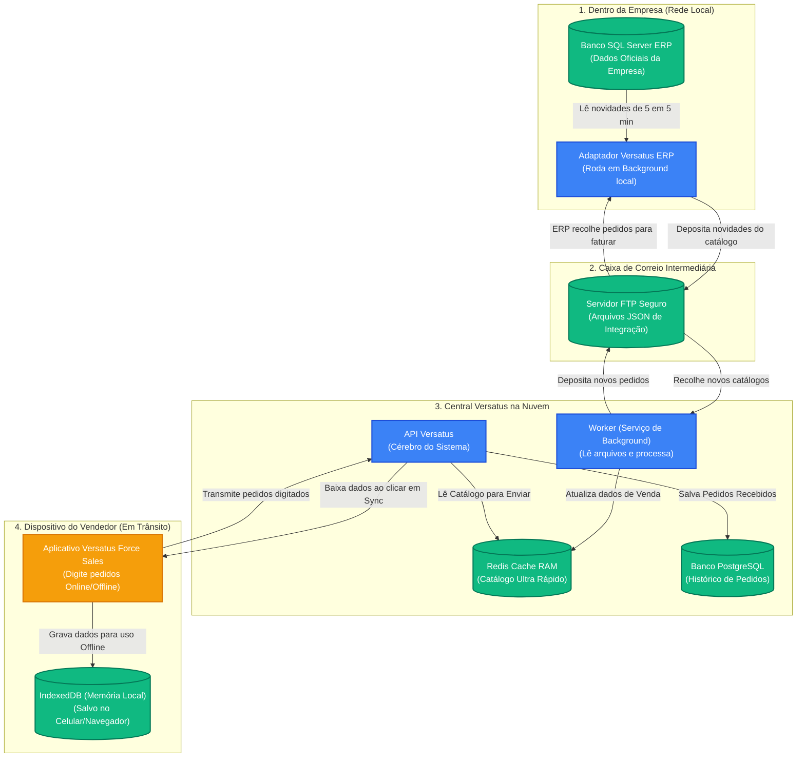

# Documento de Apresentação e Manual do Produto (Versatus Force Sales MVP)

Este documento foi elaborado como um **manual vivo** e guia de apresentação para stakeholders de negócios e usuários. Ele explica de forma simples e visual o que é o produto, quais problemas ele resolve, como cada componente funciona e qual o fluxo de dados do ecossistema.

---

## 1. O que é o Versatus Force Sales?

O **Versatus Force Sales** é uma plataforma SaaS (Software como Serviço) de **Força de Vendas** desenvolvida para permitir que representantes comerciais e vendedores externos digitem pedidos de venda diretamente de seus celulares ou computadores, **mesmo quando estiverem totalmente sem internet (Offline)**. 

### O Principal Problema Resolvido:
No dia a dia, vendedores externos visitam clientes em galpões, áreas rurais ou subsolos onde o sinal 3G/4G é instável ou inexistente. Com sistemas comuns, o vendedor não consegue consultar preços ou fechar vendas sem conexão. 
O Versatus resolve isso baixando todo o catálogo de clientes, produtos, tabelas de preços e prazos diretamente para o armazenamento do celular. O vendedor digita o pedido instantaneamente e, quando o celular detectar sinal de internet novamente, o pedido é transmitido automaticamente para a nuvem e faturado no ERP da empresa.

---

## 2. As Peças do Quebra-Cabeça (O que cada parte faz)

Para que tudo funcione de forma integrada e segura, o sistema é dividido em **4 componentes principais**:

```
┌────────────────────────────────────────────────────────────────────────┐
│                                                                        │
│  [ Celular do Vendedor ] <───(Internet)───> [ Servidor na Nuvem ]       │
│                                                   ▲                    │
│                                                   │ (FTP Seguro)       │
│                                                   ▼                    │
│                                             [ ERP da Empresa ]         │
│                                                                        │
└────────────────────────────────────────────────────────────────────────┘
```

### 📱 A. O Aplicativo de Vendas (Frontend PWA)
*   **O que o usuário vê**: Uma interface web premium, moderna e rápida que roda direto no navegador do celular ou computador do vendedor.
*   **Banco de Dados Local (IndexedDB)**: É a "memória interna" do aplicativo. Ao clicar no botão **Sincronizar**, o app baixa milhares de clientes, produtos e preços e os salva nessa memória. Toda a pesquisa de clientes e digitação de itens consome essa memória local de forma instantânea (menos de 5 milissegundos por busca), sem precisar de internet.

### ☁️ B. O Cérebro na Nuvem (API Gateway & Bancos de Dados)
*   **A API Versatus**: Recebe o login dos vendedores, valida a assinatura da empresa (Tenant) e serve os dados de forma ultra-rápida.
*   **Banco de Dados Redis (Cache de Velocidade)**: Armazena o catálogo atualizado em memória RAM na nuvem. Quando o vendedor sincroniza o celular, a API busca os dados daqui para entregar o catálogo em menos de 1 segundo.
*   **Banco de Dados PostgreSQL (Persistência Segura)**: Guarda o histórico permanente de pedidos de venda emitidos e as configurações das empresas parceiras.

### ✉️ C. A Caixa de Correio (Servidor FTP/SFTP)
*   Funciona como um intermediário de comunicação seguro. O ERP da empresa física não possui acesso direto à nuvem pública (por motivos de segurança de TI), e a nuvem não pode invadir a rede local da empresa.
*   O FTP serve como um local neutro onde o adaptador do ERP "deposita" atualizações de catálogos e o Worker da nuvem "recolhe" essas atualizações. Do mesmo modo, a nuvem deposita novos pedidos lá, e o adaptador ERP os recolhe para faturamento.

### ⚙️ D. O Adaptador do ERP Legado (ErpAdapter)
*   Um pequeno programa instalado na infraestrutura da empresa que se conecta ao banco de dados SQL Server do ERP legado.
*   **Delta Sync**: Totalmente programável. Por padrão a cada 5 minutos (configurável em segundos pelo parâmetro `CatalogExportIntervalSeconds` no `appsettings.json`), ele verifica se houve alterações no ERP local e envia apenas essas pequenas atualizações frequentes.
*   **Full Sync**: Programável por Empresa (Tenant). Uma vez por dia em horário programável (pelo parâmetro `FullSyncHour` no `appsettings.json`, com padrão às 03:00h da madrugada), ele realiza uma carga completa para garantir a limpeza de registros removidos e a consistência total com o ERP.

---

## 3. Desenho Simplificado do Fluxo de Dados

Abaixo está o mapeamento visual de como a informação trafega desde o cadastro no servidor local da empresa até o fechamento da venda na ponta.



---

## 4. Funcionalidades Principais Desenvolvidas no MVP

### 🔑 4.1 Login e Controle Multitenant (Multiempresas)
*   O vendedor entra com seu e-mail e senha. O sistema reconhece automaticamente a qual empresa (Tenant/Filial) aquele vendedor pertence e restringe todo o catálogo e as vendas apenas para aquela empresa. Não há risco de cruzamento de informações.

### 👥 4.2 Busca e Seleção de Clientes
*   Autocomplete inteligente por Nome ou CPF/CNPJ. O sistema carrega instantaneamente no celular do vendedor apenas a carteira de clientes dele e que estão **Ativos** para compras.

### ☕ 4.3 Catálogo de Produtos e Saldo
*   Visualização de itens com saldo de estoque atualizado. O sistema calcula automaticamente se o produto possui saldo suficiente e se exige controle de estoque obrigatório.

### 💰 4.4 Tabelas de Preços Dinâmicas e Desconto Máximo
*   O aplicativo carrega a tabela de preço vinculada ao cliente e ao produto.
*   Calcula o preço de venda e valida se o vendedor respeitou o limite máximo de desconto permitido pelo ERP (ex: no máximo 15% de desconto), impedindo o registro de pedidos fora da margem da empresa.

### 💳 4.5 Condições de Pagamento e Prazos
*   Exibição das condições e formas de pagamento permitidas (ex: Dinheiro à Vista com 3% de desconto, Boleto 30/60 dias). O cálculo do vencimento das parcelas é feito localmente de forma automática.

### 🔄 4.6 Central e Botão de Sincronismo
*   **Botão Rápido de Sync**: Localizado diretamente no topo da tela de Nova Venda. Com um clique, ele faz o download paralelo de todas as alterações recentes e atualiza o IndexedDB em segundo plano.
*   **Painel Administrativo de Sincronismo**: Tela dedicada que mostra o diagnóstico completo do banco de dados local do vendedor (mostrando o número exato de Clientes, Produtos, Tabelas de Preço e Prazos salvos no celular e a hora exata da última atualização).
