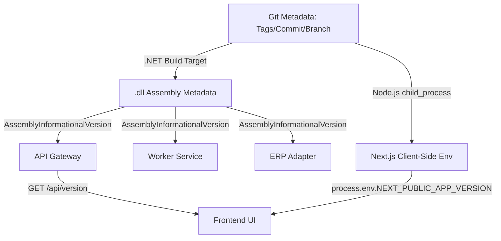

# Plano de Versão e Prompt de Execução de IA

Este documento reúne o **Plano de Implementação**, o **Diagrama de Arquitetura**, o **Checklist de Tarefas**, a **Especificação de Arquivos** e um **Prompt Pronto para IAs** executarem de forma autônoma o desenvolvimento do sistema automático de versões em todo o ecossistema (API, Worker, ERP Adapter e Frontend).

---

## 🗺️ Sumário
1. [🎯 Objetivo](#-objetivo)
2. [📐 Diagrama de Arquitetura](#-diagrama-de-arquitetura)
3. [📋 Checklist de Tarefas (Backlog)](#-checklist-de-tarefas-backlog)
4. [📂 Detalhes dos Arquivos a Modificar/Criar (Proposed Changes)](#-detalhes-dos-arquivos-a-modificarcriar-proposed-changes)
5. [🤖 Prompt de Execução para Inteligências Artificiais](#-prompt-de-execução-para-inteligências-artificiais)
6. [📄 Código de Referência e Estruturas](#-código-de-referência-e-estruturas)
7. [🧪 Plano de Verificação (Verification Plan)](#-plano-de-verificação-verification-plan)

---

## 🎯 Objetivo

Implementar o controle e a exibição de versão automatizados para todo o ecossistema de microsserviços e frontend do Força de Vendas. O sistema extrai metadados do Git (Tags, Commits e Branches) em tempo de compilação/build, eliminando a necessidade de os desenvolvedores atualizarem manualmente strings de versão.

---

## 📐 Diagrama de Arquitetura



---

## 📋 Checklist de Tarefas (Backlog)

### 1. Backend & Microsserviços (.NET Core)
*   **[ ] T1.1. Injeção de Metadados via `.csproj` (MSBuild)**
    *   Editar os arquivos `.csproj` da API, Worker e ERP Adapter.
    *   Incluir o `Target` que obtém a versão via comando Git (`git describe --tags --always --dirty` e `git rev-parse --abbrev-ref HEAD`) e injeta no parâmetro `<InformationalVersion>`.
*   **[ ] T1.2. Endpoint de Versão na API (`GET /api/version`)**
    *   Criar o endpoint sob a rota `/api/version` (rota anônima/sem autenticação JWT).
    *   Fazer o endpoint ler o metadado `AssemblyInformationalVersion` da API e retornar em formato JSON (contendo: nome da app, versão do git + build time, ambiente e versão do .NET).
*   **[ ] T1.3. Argumento CLI e Logs no Worker**
    *   Ajustar o `Program.cs` do Worker para exibir a versão no console durante a inicialização.
    *   Ajustar a captura de argumentos de linha de comando (`args`). Se o comando for executado com `-v` ou `--version`, escrever a versão no console e finalizar o processo imediatamente (`return`).
*   **[ ] T1.4. Argumento CLI e Logs no ERP Adapter**
    *   Ajustar o `Program.cs` do ERP Adapter para exibir a versão no log ao iniciar.
    *   Interceptar argumentos e, ao receber `-v` ou `--version`, imprimir a versão e encerrar imediatamente.

### 2. Frontend (Next.js & React)
*   **[ ] T2.1. Injeção da Versão no `next.config.ts`**
    *   Importar `execSync` e rodar a busca do Git no arquivo de configuração do Next.
    *   Injetar a versão calculada na chave global de variáveis de ambiente: `env: { NEXT_PUBLIC_APP_VERSION: ... }`.
*   **[ ] T2.2. Exibição da Versão no Login**
    *   Modificar a página de Login para exibir as versões de forma discreta na parte inferior.
    *   Chamar a API de versão de forma assíncrona. Exibir: `App: {versao_front} • API: {versao_api}`.
*   **[ ] T2.3. Exibição da Versão na Área Logada (Sidebar)**
    *   Modificar a barra lateral do dashboard para ler a variável de ambiente do frontend e fazer a chamada de busca da versão da API.
    *   Exibir as versões abaixo do menu lateral de forma elegante.

---

## 📂 Detalhes dos Arquivos a Modificar/Criar (Proposed Changes)

### 1. Projetos C# Backend (.NET Core)

#### [MODIFY] [Versatus.ForcaVendas.Api.csproj](file:///c:/Pasta%20de%20Trabalho/Projetos/Analises/Versatus.Net/versatus-force-sales-mvp/src/backend/Versatus.ForcaVendas.Api/Versatus.ForcaVendas.Api.csproj)
#### [MODIFY] [Versatus.ForcaVendas.Worker.csproj](file:///c:/Pasta%20de%20Trabalho/Projetos/Analises/Versatus.Net/versatus-force-sales-mvp/src/worker/Versatus.ForcaVendas.Worker/Versatus.ForcaVendas.Worker.csproj)
#### [MODIFY] [Versatus.ForcaVendas.ErpAdapter.csproj](file:///c:/Pasta%20de%20Trabalho/Projetos/Analises/Versatus.Net/versatus-force-sales-mvp/src/erp-adapter/Versatus.ForcaVendas.ErpAdapter/Versatus.ForcaVendas.ErpAdapter.csproj)
* Incluir o Target `<Target Name="PopulateVersionInfo" BeforeTargets="BeforeBuild">` antes do fechamento de `</Project>`.
* Esse target executa comandos Git e injeta o resultado na propriedade `<InformationalVersion>` do compilador. (Ver exemplo de código na Seção 6).

---

### 2. API Gateway (`Versatus.ForcaVendas.Api`)

#### [NEW] [VersionEndpoints.cs](file:///c:/Pasta%20de%20Trabalho/Projetos/Analises/Versatus.Net/versatus-force-sales-mvp/src/backend/Versatus.ForcaVendas.Api/Version/VersionEndpoints.cs)
* Criar uma rota pública/anônima (sem necessidade de login) `GET /api/version`.
* Deve obter a versão do Assembly:
  `var version = typeof(Program).Assembly.GetCustomAttribute<AssemblyInformationalVersionAttribute>()?.InformationalVersion ?? "1.0.0-unknown";`
* Retorna um objeto JSON:
  ```json
  {
    "appName": "Versatus Force Sales API",
    "version": "v1.0.2-3-g09a8a86-develop (Build: 2026-07-08 01:10:00 UTC)",
    "environment": "Production",
    "dotnetVersion": ".NET 10.0"
  }
  ```

---

### 3. Worker e ERP Adapter (`Worker` & `ErpAdapter`)

#### [MODIFY] [Program.cs (Worker)](file:///c:/Pasta%20de%20Trabalho/Projetos/Analises/Versatus.Net/versatus-force-sales-mvp/src/worker/Versatus.ForcaVendas.Worker/Program.cs)
#### [MODIFY] [Program.cs (ErpAdapter)](file:///c:/Pasta%20de%20Trabalho/Projetos/Analises/Versatus.Net/versatus-force-sales-mvp/src/erp-adapter/Versatus.ForcaVendas.ErpAdapter/Program.cs)
* **Log de Inicialização**: Assim que o serviço subir, imprimir no console/logger:
  `LogInformation("Inicializando [NomeApp] - Versão: {Version}", version)`
* **Argumento CLI**: Adicionar interceptação dos argumentos de entrada `args`. Se o comando for executado passando `-v` ou `--version`, ele imprime a versão do build no console (`Console.WriteLine`) e encerra o processo imediatamente (`return`).

---

### 4. Frontend Web App (Next.js)

#### [MODIFY] [next.config.ts](file:///c:/Pasta%20de%20Trabalho/Projetos/Analises/Versatus.Net/versatus-force-sales-mvp/src/frontend/app/next.config.ts)
* Utilizar a biblioteca nativa `child_process` para rodar `git describe` e expor a versão em tempo de build através da chave de ambiente do Next: `env: { NEXT_PUBLIC_APP_VERSION: ... }`. (Ver exemplo de código na Seção 6).

#### [MODIFY] [Sidebar.tsx](file:///c:/Pasta%20de%20Trabalho/Projetos/Analises/Versatus.Net/versatus-force-sales-mvp/src/frontend/app/src/components/layout/Sidebar.tsx)
* Ao carregar a tela, fazer uma chamada assíncrona para o endpoint `GET /api/version` da API.
* Exibir de forma sutil no rodapé da barra lateral:
  * **Frontend**: `v1.0.2-develop`
  * **Backend**: `v1.0.2-develop`
* Se a chamada falhar, mostrar `Backend: Indisponível`.

#### [MODIFY] [page.tsx (Login)](file:///c:/Pasta%20de%20Trabalho/Projetos/Analises/Versatus.Net/versatus-force-sales-mvp/src/frontend/app/src/app/login/page.tsx)
* Exibir a versão do frontend e da API logo abaixo do formulário de login de forma minimalista.

---

## 🤖 Prompt de Execução para Inteligências Artificiais

> Copie e cole o prompt abaixo no console da IA de desenvolvimento (ex: Claude, Gemini, ChatGPT) para que ela realize todo o trabalho de forma autônoma.

```text
Você é um desenvolvedor sênior encarregado de implementar um controle automático de versão no projeto. Não altere chaves de negócio ou lógicas de funcionamento, apenas integre a captura e exibição de versão.

Siga exatamente os passos abaixo:

1. MODIFICAR OS ARQUIVOS .CSPROJ DO BACKEND
Edite os seguintes arquivos:
- src/backend/Versatus.ForcaVendas.Api/Versatus.ForcaVendas.Api.csproj
- src/worker/Versatus.ForcaVendas.Worker/Versatus.ForcaVendas.Worker.csproj
- src/erp-adapter/Versatus.ForcaVendas.ErpAdapter/Versatus.ForcaVendas.ErpAdapter.csproj

Insira o Target do MSBuild antes do final da tag </Project>:
<Target Name="PopulateVersionInfo" BeforeTargets="BeforeBuild">
  <Exec Command="git describe --tags --always --dirty" ConsoleToMSBuild="true" IgnoreExitCode="true">
    <Output TaskParameter="ConsoleOutput" PropertyName="GitVersion" />
  </Exec>
  <Exec Command="git rev-parse --abbrev-ref HEAD" ConsoleToMSBuild="true" IgnoreExitCode="true">
    <Output TaskParameter="ConsoleOutput" PropertyName="GitBranch" />
  </Exec>
  <PropertyGroup>
    <ActualVersion Condition="'$(GitVersion)' != ''">$(GitVersion)</ActualVersion>
    <ActualVersion Condition="'$(GitVersion)' == ''">1.0.0-dev</ActualVersion>
    <ActualVersion Condition="'$(GitBranch)' != ''">$(ActualVersion)-$(GitBranch)</ActualVersion>
    <Version>$(ActualVersion)</Version>
    <InformationalVersion>$(ActualVersion) (Build: $([System.DateTime]::UtcNow.ToString("yyyy-MM-dd HH:mm:ss")) UTC)</InformationalVersion>
  </PropertyGroup>
</Target>

2. CRIAR O ENDPOINT DE VERSÃO NA API
Crie o arquivo "src/backend/Versatus.ForcaVendas.Api/Version/VersionEndpoints.cs" com uma rota pública "GET /api/version" (mapeado sem autenticação). Ele deve obter a versão do Assembly:
var version = typeof(Program).Assembly.GetCustomAttribute<AssemblyInformationalVersionAttribute>()?.InformationalVersion ?? "1.0.0-unknown";
Retorne um objeto JSON contendo:
{
  "appName": "Versatus Force Sales API",
  "version": version,
  "environment": builder.Environment.EnvironmentName,
  "dotnetVersion": System.Runtime.InteropServices.RuntimeInformation.FrameworkDescription
}
Registre esse endpoint no mapeamento de rotas em Program.cs.

3. CONFIGURAR CLI E LOGS DO WORKER E ERP ADAPTER
Edite:
- src/worker/Versatus.ForcaVendas.Worker/Program.cs
- src/erp-adapter/Versatus.ForcaVendas.ErpAdapter/Program.cs

Em ambos os arquivos, logo no início do fluxo principal de Program.cs (antes do build/run do host):
Verifique se args contém "-v" ou "--version". Se sim, escreva o valor do InformationalVersion no Console e faça um retorno imediato (encerrando a execução).
Imprima também a versão no logger no momento em que o serviço iniciar (no construtor ou no início do serviço de background).

4. CONFIGURAR NEXT.JS DO FRONTEND
Edite "src/frontend/app/next.config.ts".
Importe "child_process" de forma segura. Execute "git describe --tags --always --dirty" e "git rev-parse --abbrev-ref HEAD" de forma síncrona.
Injete o resultado em process.env.NEXT_PUBLIC_APP_VERSION adicionando a chave "env" no objeto "nextConfig". Caso ocorra erro ao rodar os comandos do git (ex: máquina sem git), defina um fallback como "1.0.0-dev".

5. EXIBIR AS VERSÕES NO FRONTEND
- Edite a página de login "src/frontend/app/src/app/login/page.tsx".
- Edite a barra lateral de navegação "src/frontend/app/src/components/layout/Sidebar.tsx".
Chame de forma assíncrona o endpoint "GET /api/version" na API (usando fetch ou axios).
Exiba em ambos os componentes as versões no formato:
"Front: {NEXT_PUBLIC_APP_VERSION} • API: {api_version}"
Se a chamada à API falhar, mostre "API: Indisponível".
```

---

## 📄 Código de Referência e Estruturas

### Mapeamento do C# para pegar o metadado
```csharp
using System.Reflection;

var informationalVersion = Assembly.GetEntryAssembly()
    ?.GetCustomAttribute<AssemblyInformationalVersionAttribute>()
    ?.InformationalVersion ?? "1.0.0-unknown";
```

### Configuração do Next.js (`next.config.ts`)
```typescript
import type { NextConfig } from 'next'
import { execSync } from 'child_process'

let gitVersion = '1.0.0-dev'
try {
  const versionString = execSync('git describe --tags --always --dirty').toString().trim()
  const branchString = execSync('git rev-parse --abbrev-ref HEAD').toString().trim()
  gitVersion = `${versionString}-${branchString}`
} catch (e) {
  // Fallback caso falte o git no ambiente de deploy
}

const nextConfig: NextConfig = {
  env: {
    NEXT_PUBLIC_APP_VERSION: gitVersion,
  },
  // ... outras configurações existentes ...
}

export default nextConfig
```

---

## 🧪 Plano de Verificação (Verification Plan)

### Automated Verification
* Compilar a API localmente (`dotnet build`) e conferir o metadado do `.dll` gerado.
* Executar o comando no terminal:
  `dotnet run --project src/erp-adapter/Versatus.ForcaVendas.ErpAdapter -- --version`
  Verificar se exibe a tag do Git com a branch correspondente.

### Manual Verification
1. Abrir a rota `http://localhost:5000/api/version` e conferir o JSON retornado.
2. Acessar a tela de login do aplicativo e verificar a exibição da versão.
3. Entrar no Dashboard e verificar as versões exibidas na barra lateral.
