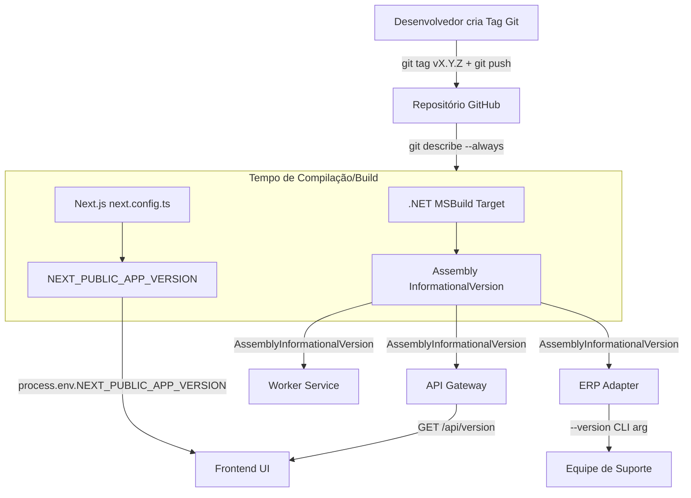

# Plano de Versão e Prompt de Execução de IA

Este documento reúne o **Plano de Implementação**, o **Diagrama de Arquitetura**, o **Checklist de Tarefas**, a **Especificação de Arquivos** e um **Prompt Pronto para IAs** executarem de forma autônoma o desenvolvimento do sistema automático de versões em todo o ecossistema (API, Worker, ERP Adapter e Frontend).

---

## 🗺️ Sumário
1. [🎯 Objetivo](#-objetivo)
2. [🏷️ Estratégia de Tags Git (Versionamento Semântico)](#-estratégia-de-tags-git-versionamento-semântico)
3. [📐 Diagrama de Arquitetura](#-diagrama-de-arquitetura)
4. [📋 Checklist de Tarefas (Backlog)](#-checklist-de-tarefas-backlog)
5. [📂 Detalhes dos Arquivos a Modificar/Criar (Proposed Changes)](#-detalhes-dos-arquivos-a-modificarcriar-proposed-changes)
6. [🤖 Prompt de Execução para Inteligências Artificiais](#-prompt-de-execução-para-inteligências-artificiais)
7. [📄 Código de Referência e Estruturas](#-código-de-referência-e-estruturas)
8. [🧪 Plano de Verificação (Verification Plan)](#-plano-de-verificação-verification-plan)

---

## 🎯 Objetivo

Implementar o controle e a exibição de versão automatizados para todo o ecossistema de microsserviços e frontend do Força de Vendas. O sistema extrai metadados do Git (Tags, Commits e Branches) em tempo de compilação/build, eliminando a necessidade de os desenvolvedores atualizarem manualmente strings de versão.

---

## 🏷️ Estratégia de Tags Git (Versionamento Semântico)

> [!IMPORTANT]
> Antes de qualquer compilação ou deploy, o repositório **deve ter pelo menos uma tag Git** criada. Sem ela, `git describe --tags` retornará apenas o hash do commit (ex: `09a8a86`), sem número de versão legível.

### Quem cria as tags?
As tags são criadas pelo **responsável pelo projeto** (desenvolvedor líder ou PO) no momento em que uma versão estável é entregue ou publicada em produção. Não é automático — é uma decisão deliberada de "marcar" um ponto de lançamento.

### Padrão adotado: SemVer 2.0
O projeto adota o formato `vMAJOR.MINOR.PATCH`:
- **MAJOR** — Mudança de contrato de integração incompatível com versões anteriores
- **MINOR** — Nova funcionalidade entregue e compatível com versões anteriores
- **PATCH** — Correção de bug em produção sem quebrar funcionalidades existentes

### Como a versão aparece nas aplicações

| Contexto do Build | Versão Exibida na App |
|---|---|
| Compilado exatamente sobre uma tag | `v1.1.1+main` |
| 3 commits após a última tag | `v1.1.1-3-g09a8a86+develop` |
| Sem tags no repositório | `09a8a86+develop` |

> O separador `+branch` ao final segue o padrão **SemVer 2.0** de metadados de build, claramente separando a identificação de versão estável dos metadados de ramo.

### Como criar a primeira tag (passo obrigatório antes do deploy)
```bash
# Na branch main, após a compilação final estar estável:
git checkout main
git tag v1.0.0 -m "MVP: primeira versão estável entregue ao cliente"
git push origin v1.0.0
```

### Tabela de evolução de tags sugeridas

| Tag | Quando criar |
|---|---|
| `v1.0.0` | Entrega do MVP ao primeiro cliente |
| `v1.1.0` | Nova funcionalidade: Pré-Cadastro de Cliente |
| `v1.1.1` | Correção: Ajuste de fuso horário Cuiabá/Brasília |
| `v1.2.0` | Nova funcionalidade: Sistema de Versionamento Automático |

---

## 📐 Diagrama de Arquitetura



---

## 📋 Checklist de Tarefas (Backlog)

### Pré-requisito: Criar a tag inicial no Git
*   **[ ] T0. Criar e publicar a tag `v1.0.0` no repositório**
    *   Verificar que a branch `main` está atualizada e estável.
    *   Executar: `git checkout main && git tag v1.0.0 -m "MVP: primeira versão estável" && git push origin v1.0.0`

### 1. Backend & Microsserviços (.NET Core)
*   **[ ] T1.1. Injeção de Metadados via `.csproj` (MSBuild)**
    *   Editar os arquivos `.csproj` da API, Worker e ERP Adapter.
    *   Incluir o `Target` que obtém a versão via `git describe --tags --always` e a branch via `git rev-parse --abbrev-ref HEAD`.
    *   Injetar no parâmetro `<InformationalVersion>` usando o separador `+branch` (padrão SemVer 2.0).
*   **[ ] T1.2. Endpoint de Versão na API (`GET /api/version`)**
    *   Criar o endpoint sob a rota `/api/version` (rota anônima/sem autenticação JWT).
    *   Fazer o endpoint ler o metadado `AssemblyInformationalVersion` e retornar em formato JSON.
*   **[ ] T1.3. Argumento CLI e Logs no Worker**
    *   Ajustar o `Program.cs` do Worker para exibir a versão no console/logger durante a inicialização.
    *   Interceptar `-v` ou `--version`: exibir versão e encerrar imediatamente.
*   **[ ] T1.4. Argumento CLI e Logs no ERP Adapter**
    *   Ajustar o `Program.cs` do ERP Adapter para exibir a versão no log ao iniciar.
    *   Interceptar `-v` ou `--version`: exibir versão e encerrar imediatamente.
    *   **Especialmente importante**: o ERP Adapter roda localmente no cliente — o `--version` permite à equipe de suporte confirmar qual versão está instalada remotamente sem acesso ao servidor.

### 2. Frontend (Next.js & React)
*   **[ ] T2.1. Injeção da Versão no `next.config.ts`**
    *   Importar `execSync` e rodar `git describe` no arquivo de configuração do Next.
    *   Injetar a versão calculada na chave global: `env: { NEXT_PUBLIC_APP_VERSION: ... }`.
    *   Garantir fallback `1.0.0-dev` para ambientes de build sem Git disponível.
*   **[ ] T2.2. Exibição da Versão no Login**
    *   Modificar a página de Login para exibir as versões de forma discreta na parte inferior.
    *   Exibir: `App: {versao_front} • API: {versao_api}`. Mostrar `Indisponível` se a API não responder.
*   **[ ] T2.3. Exibição da Versão na Área Logada (Sidebar)**
    *   Modificar a barra lateral do dashboard para exibir as versões do frontend e da API.
    *   Exibir versões abaixo do menu lateral de forma sutil e elegante.

---

## 📂 Detalhes dos Arquivos a Modificar/Criar (Proposed Changes)

### 1. Projetos C# Backend (.NET Core)

#### [MODIFY] [Versatus.ForcaVendas.Api.csproj](file:///c:/Pasta%20de%20Trabalho/Projetos/Analises/Versatus.Net/versatus-force-sales-mvp/src/backend/Versatus.ForcaVendas.Api/Versatus.ForcaVendas.Api.csproj)
#### [MODIFY] [Versatus.ForcaVendas.Worker.csproj](file:///c:/Pasta%20de%20Trabalho/Projetos/Analises/Versatus.Net/versatus-force-sales-mvp/src/worker/Versatus.ForcaVendas.Worker/Versatus.ForcaVendas.Worker.csproj)
#### [MODIFY] [Versatus.ForcaVendas.ErpAdapter.csproj](file:///c:/Pasta%20de%20Trabalho/Projetos/Analises/Versatus.Net/versatus-force-sales-mvp/src/erp-adapter/Versatus.ForcaVendas.ErpAdapter/Versatus.ForcaVendas.ErpAdapter.csproj)
* Incluir o Target `<Target Name="PopulateVersionInfo" BeforeTargets="BeforeBuild">` antes do fechamento de `</Project>`. (Ver exemplo de código na Seção 7).
* O separador entre versão e branch usa `+` (padrão SemVer 2.0) e não `-` para evitar duplicidade com commits intermediários do `git describe`.

---

### 2. API Gateway (`Versatus.ForcaVendas.Api`)

#### [NEW] [VersionEndpoints.cs](file:///c:/Pasta%20de%20Trabalho/Projetos/Analises/Versatus.Net/versatus-force-sales-mvp/src/backend/Versatus.ForcaVendas.Api/Version/VersionEndpoints.cs)
* Criar rota pública/anônima `GET /api/version` (sem autenticação JWT).
* Retorna um objeto JSON:
  ```json
  {
    "appName": "Versatus Force Sales API",
    "version": "v1.1.1-3-g09a8a86+develop (Build: 2026-07-08 12:00:00 UTC)",
    "environment": "Production",
    "dotnetVersion": ".NET 10.0.x"
  }
  ```

---

### 3. Worker e ERP Adapter (`Worker` & `ErpAdapter`)

#### [MODIFY] [Program.cs (Worker)](file:///c:/Pasta%20de%20Trabalho/Projetos/Analises/Versatus.Net/versatus-force-sales-mvp/src/worker/Versatus.ForcaVendas.Worker/Program.cs)
#### [MODIFY] [Program.cs (ErpAdapter)](file:///c:/Pasta%20de%20Trabalho/Projetos/Analises/Versatus.Net/versatus-force-sales-mvp/src/erp-adapter/Versatus.ForcaVendas.ErpAdapter/Program.cs)
* **Log de Inicialização**: `LogInformation("Inicializando {App} - Versão: {Version}", appName, version)`
* **Argumento CLI** (`-v` / `--version`): imprime versão no console e encerra imediatamente.
  * No cliente: `Versatus.ForcaVendas.ErpAdapter.exe --version` → exibe `v1.1.1+main (Build: 2026-07-08 UTC)`

---

### 4. Frontend Web App (Next.js)

#### [MODIFY] [next.config.ts](file:///c:/Pasta%20de%20Trabalho/Projetos/Analises/Versatus.Net/versatus-force-sales-mvp/src/frontend/app/next.config.ts)
* Usar `execSync` para capturar a versão do Git em tempo de build.
* Fallback: `'1.0.0-dev'` caso o ambiente de build não tenha Git disponível (Docker clean build, CI sem `.git`).

#### [MODIFY] [Sidebar.tsx](file:///c:/Pasta%20de%20Trabalho/Projetos/Analises/Versatus.Net/versatus-force-sales-mvp/src/frontend/app/src/components/layout/Sidebar.tsx)
* Exibir no rodapé: `Front: v1.1.1+develop • API: v1.1.1+main`
* Se a chamada à API falhar: `API: Indisponível`

#### [MODIFY] [page.tsx (Login)](file:///c:/Pasta%20de%20Trabalho/Projetos/Analises/Versatus.Net/versatus-force-sales-mvp/src/frontend/app/src/app/login/page.tsx)
* Exibir versão do frontend e da API abaixo do formulário de login de forma discreta e minimalista.

---

## 🤖 Prompt de Execução para Inteligências Artificiais

> Copie e cole o prompt abaixo no console da IA de desenvolvimento (ex: Claude, Gemini, ChatGPT) para que ela realize todo o trabalho de forma autônoma.

```text
Você é um desenvolvedor sênior encarregado de implementar um controle automático de versão no projeto Versatus Force Sales MVP. Não altere chaves de negócio ou lógicas de funcionamento, apenas integre a captura e exibição de versão. Siga EXATAMENTE os passos abaixo, sem pular nenhum.

=== CONTEXTO IMPORTANTE ===
- O projeto usa .NET Core (API, Worker, ERP Adapter) + Next.js (Frontend)
- A versão é extraída do Git em tempo de compilação usando a tag mais recente
- Se não existir tag no repositório, o comando `git tag v1.0.0 -m "MVP" && git push origin v1.0.0` deve ser executado primeiro
- A versão segue SemVer 2.0. O separador entre versão e branch é `+` (não `-`)
- Exemplo de versão esperada: `v1.1.1-3-g09a8a86+develop (Build: 2026-07-08 12:00:00 UTC)`

=== PASSO 1: VERIFICAR/CRIAR TAG INICIAL ===
Execute no terminal:
  git tag
Se não houver nenhuma tag listada, execute:
  git checkout main
  git tag v1.0.0 -m "MVP: primeira versão estável"
  git push origin v1.0.0

=== PASSO 2: MODIFICAR OS ARQUIVOS .CSPROJ DO BACKEND ===
Edite os três arquivos abaixo, inserindo o Target MSBuild antes do fechamento </Project>:
- src/backend/Versatus.ForcaVendas.Api/Versatus.ForcaVendas.Api.csproj
- src/worker/Versatus.ForcaVendas.Worker/Versatus.ForcaVendas.Worker.csproj
- src/erp-adapter/Versatus.ForcaVendas.ErpAdapter/Versatus.ForcaVendas.ErpAdapter.csproj

Código a inserir antes de </Project>:
  <Target Name="PopulateVersionInfo" BeforeTargets="BeforeBuild">
    <Exec Command="git describe --tags --always" ConsoleToMSBuild="true" IgnoreExitCode="true">
      <Output TaskParameter="ConsoleOutput" PropertyName="GitVersion" />
    </Exec>
    <Exec Command="git rev-parse --abbrev-ref HEAD" ConsoleToMSBuild="true" IgnoreExitCode="true">
      <Output TaskParameter="ConsoleOutput" PropertyName="GitBranch" />
    </Exec>
    <PropertyGroup>
      <ActualVersion Condition="'$(GitVersion)' != ''">$(GitVersion.Trim())</ActualVersion>
      <ActualVersion Condition="'$(GitVersion)' == ''">1.0.0-unknown</ActualVersion>
      <GitBranchClean Condition="'$(GitBranch)' != ''">$(GitBranch.Trim())</GitBranchClean>
      <GitBranchClean Condition="'$(GitBranch)' == ''">local</GitBranchClean>
      <Version>$(ActualVersion)</Version>
      <InformationalVersion>$(ActualVersion)+$(GitBranchClean) (Build: $([System.DateTime]::UtcNow.ToString("yyyy-MM-dd HH:mm:ss")) UTC)</InformationalVersion>
    </PropertyGroup>
  </Target>

=== PASSO 3: CRIAR O ENDPOINT DE VERSÃO NA API ===
Crie o arquivo "src/backend/Versatus.ForcaVendas.Api/Version/VersionEndpoints.cs":

using System.Reflection;
using System.Runtime.InteropServices;
public static class VersionEndpoints
{
    public static IEndpointRouteBuilder MapVersionEndpoints(this IEndpointRouteBuilder app)
    {
        app.MapGet("/api/version", () =>
        {
            var version = typeof(VersionEndpoints).Assembly
                .GetCustomAttribute<AssemblyInformationalVersionAttribute>()
                ?.InformationalVersion ?? "1.0.0-unknown";
            return Results.Ok(new
            {
                appName = "Versatus Force Sales API",
                version,
                environment = Environment.GetEnvironmentVariable("ASPNETCORE_ENVIRONMENT") ?? "Production",
                dotnetVersion = RuntimeInformation.FrameworkDescription
            });
        }).AllowAnonymous();
        return app;
    }
}

Em seguida, registre o endpoint no Program.cs da API adicionando:
  app.MapVersionEndpoints();

=== PASSO 4: CONFIGURAR CLI E LOGS DO WORKER E ERP ADAPTER ===
Edite o início do Program.cs de AMBOS os serviços:
- src/worker/Versatus.ForcaVendas.Worker/Program.cs
- src/erp-adapter/Versatus.ForcaVendas.ErpAdapter/Program.cs

Adicione logo no início (antes de qualquer builder ou host):
  var version = typeof(Program).Assembly
      .GetCustomAttribute<System.Reflection.AssemblyInformationalVersionAttribute>()
      ?.InformationalVersion ?? "1.0.0-unknown";

  if (args.Contains("-v") || args.Contains("--version"))
  {
      Console.WriteLine(version);
      return;
  }

E no momento que o logger estiver disponível (logo após o build do host):
  logger.LogInformation("Inicializando {App} — Versão: {Version}", "NomeDoServico", version);

=== PASSO 5: CONFIGURAR NEXT.JS DO FRONTEND ===
Edite "src/frontend/app/next.config.ts". Substitua o conteúdo por:

import type { NextConfig } from 'next'
import { execSync } from 'child_process'

let gitVersion = '1.0.0-dev'
try {
  const tag = execSync('git describe --tags --always').toString().trim()
  const branch = execSync('git rev-parse --abbrev-ref HEAD').toString().trim()
  gitVersion = `${tag}+${branch}`
} catch {
  // Fallback: ambiente sem Git (Docker clean build)
}

const apiUrl = process.env.NEXT_PUBLIC_API_URL

const nextConfig: NextConfig = {
  env: {
    NEXT_PUBLIC_APP_VERSION: gitVersion,
  },
  ...(apiUrl ? {
    async rewrites() {
      return [{ source: '/api/:path*', destination: `${apiUrl}/:path*` }]
    },
  } : {}),
}

export default nextConfig

=== PASSO 6: EXIBIR AS VERSÕES NO FRONTEND ===
a) Edite a página de login "src/frontend/app/src/app/login/page.tsx":
   - No final do JSX do componente, adicione abaixo do formulário de login:
     <p className="text-center text-xs text-default-400 mt-4">
       Front: {process.env.NEXT_PUBLIC_APP_VERSION ?? '...'} • API: {apiVersion}
     </p>
   - apiVersion vem de um estado que busca GET /api/version de forma assíncrona com useEffect.
   - Se a requisição falhar, mostrar "API: Indisponível".

b) Edite a barra lateral "src/frontend/app/src/components/layout/Sidebar.tsx":
   - No rodapé da sidebar, adicione um bloco de versões sutis:
     <div className="text-xs text-default-400 p-2">
       <span>Front: {process.env.NEXT_PUBLIC_APP_VERSION ?? '...'}</span>
       <span>API: {apiVersion}</span>
     </div>
   - apiVersion vem de um estado com fetch para GET /api/version.
   - Se falhar, mostrar "Indisponível".
```

---

## 📄 Código de Referência e Estruturas

### MSBuild Target (`.csproj`)
```xml
<Target Name="PopulateVersionInfo" BeforeTargets="BeforeBuild">
  <Exec Command="git describe --tags --always" ConsoleToMSBuild="true" IgnoreExitCode="true">
    <Output TaskParameter="ConsoleOutput" PropertyName="GitVersion" />
  </Exec>
  <Exec Command="git rev-parse --abbrev-ref HEAD" ConsoleToMSBuild="true" IgnoreExitCode="true">
    <Output TaskParameter="ConsoleOutput" PropertyName="GitBranch" />
  </Exec>
  <PropertyGroup>
    <ActualVersion Condition="'$(GitVersion)' != ''">$(GitVersion.Trim())</ActualVersion>
    <ActualVersion Condition="'$(GitVersion)' == ''">1.0.0-unknown</ActualVersion>
    <GitBranchClean Condition="'$(GitBranch)' != ''">$(GitBranch.Trim())</GitBranchClean>
    <GitBranchClean Condition="'$(GitBranch)' == ''">local</GitBranchClean>
    <Version>$(ActualVersion)</Version>
    <InformationalVersion>$(ActualVersion)+$(GitBranchClean) (Build: $([System.DateTime]::UtcNow.ToString("yyyy-MM-dd HH:mm:ss")) UTC)</InformationalVersion>
  </PropertyGroup>
</Target>
```

### Mapeamento do C# para pegar o metadado
```csharp
using System.Reflection;

var version = typeof(Program).Assembly
    .GetCustomAttribute<AssemblyInformationalVersionAttribute>()
    ?.InformationalVersion ?? "1.0.0-unknown";
```

### Configuração do Next.js (`next.config.ts`)
```typescript
import type { NextConfig } from 'next'
import { execSync } from 'child_process'

let gitVersion = '1.0.0-dev'
try {
  const tag = execSync('git describe --tags --always').toString().trim()
  const branch = execSync('git rev-parse --abbrev-ref HEAD').toString().trim()
  gitVersion = `${tag}+${branch}`
} catch {
  // Fallback: ambiente sem Git (Docker clean build, CI sem .git)
}
```

---

## 🧪 Plano de Verificação (Verification Plan)

### Local
1. Compilar a API: `dotnet build src/backend/Versatus.ForcaVendas.Api`
   → Verificar que o log do MSBuild mostra a versão extraída do Git.
2. Testar CLI do ERP Adapter:
   `dotnet run --project src/erp-adapter/Versatus.ForcaVendas.ErpAdapter -- --version`
   → Deve imprimir `v1.0.0+feature/ajuste-fuso-horario (Build: ...)` e encerrar.
3. Acessar `http://localhost:5000/api/version`
   → Deve retornar JSON com versão, ambiente e runtime .NET.
4. Acessar o app em `http://localhost:3000/login`
   → Deve exibir versão do front e versão da API na parte inferior da tela.
5. Acessar o Dashboard e verificar rodapé da Sidebar com as duas versões exibidas.

### Ambiente ICP (Produção/Dev)
6. Após deploy no ICP, acessar `https://app-dev.versatusapp.com.br/api/version`
   → Confirmar que o build do pipeline do GitHub Actions injetou a versão corretamente.
7. Verificar a tela de login e sidebar do app de produção:
   `https://app-dev.versatusapp.com.br/login`

### No cliente (ERP Adapter instalado)
8. Abrir o prompt de comando (CMD) na pasta onde o `.exe` está instalado e executar:
   `Versatus.ForcaVendas.ErpAdapter.exe --version`
   → Confirmar a versão exibida corresponde ao pacote enviado ao cliente.
