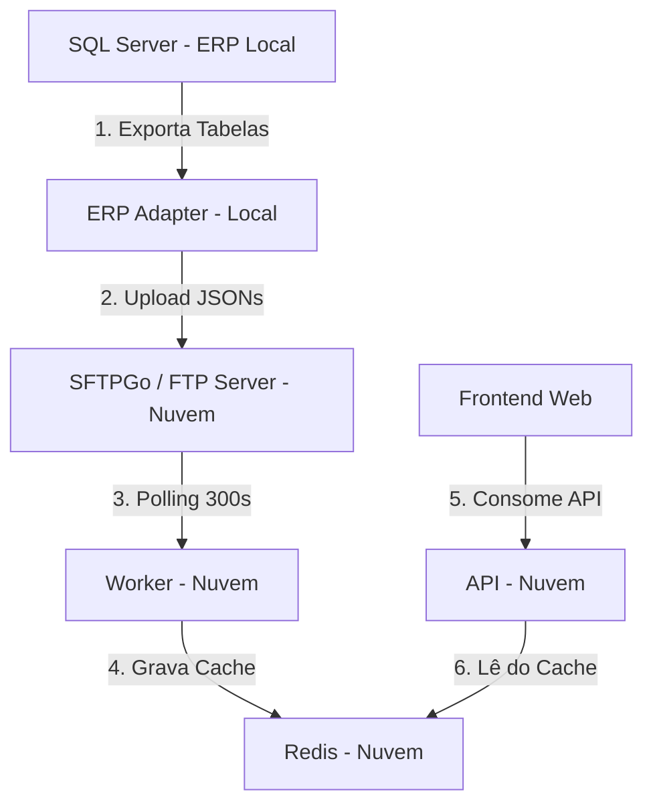
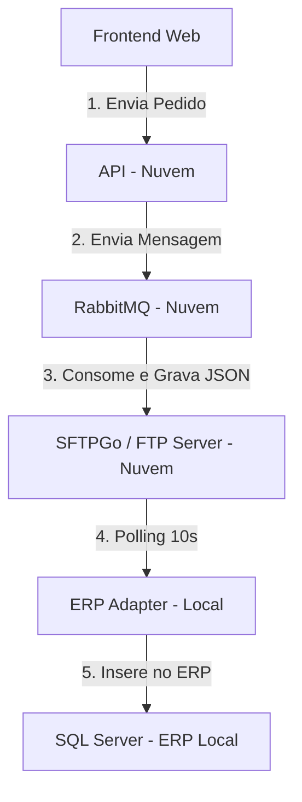

# Manual de Suporte e Resolução de Problemas (Troubleshooting) - Versatus Force Sales

Este documento serve como guia prático para a equipe de suporte e operações diagnosticar, entender e resolver problemas operacionais na integração do **Versatus Force Sales MVP**.

---

## Sumário

1. [1. Arquitetura e Fluxo de Dados](#1-arquitetura-e-fluxo-de-dados)
   * [1.1. Sincronização do Catálogo (Entrada de Dados)](#11-sincronizacao-do-catalogo-entrada-de-dados)
   * [1.2. Integração de Pedidos (Saída de Dados)](#12-integracao-de-pedidos-saida-de-dados)
2. [2. Regras Operacionais da Integração](#2-regras-operacionais-da-integracao)
   * [2.1. Carga Total (Full Sync) vs. Carga Incremental (Delta Sync)](#21-carga-total-full-sync-vs-carga-incremental-delta-sync)
   * [2.2. Sobrescrita de Arquivos no FTP/SFTP](#22-sobrescrita-de-arquivos-no-ftpsftp)
3. [3. Guia de Diagnóstico e Resolução de Problemas (Troubleshooting)](#3-guia-de-diagnostico-e-resolucao-de-problemas-troubleshooting)
   * [3.1. Tela Vazia (Sem Clientes, Produtos ou Condições de Pagamento)](#31-tela-vazia-sem-clientes-produtos-ou-condicoes-de-pagamento)
   * [3.2. Bloqueio por Erro de CORS no Frontend](#32-bloqueio-por-erro-de-cors-no-frontend)
   * [3.3. Falha de Autenticação SSH/FTP no ERP Adapter](#33-falha-de-autenticacao-sshftp-no-erp-adapter)
   * [3.4. Pedidos do Frontend Não Aparecem no ERP](#34-pedidos-do-frontend-nao-aparecem-no-erp)

---

## 1. Arquitetura e Fluxo de Dados

Para dar suporte eficiente, é fundamental entender o caminho que o dado percorre em cada fluxo:

### 1.1. Sincronização do Catálogo (Entrada de Dados)
Este fluxo traz os dados cadastrais do ERP local para o aplicativo de vendas na nuvem.

### 1.2. Integração de Pedidos (Saída de Dados)
Este fluxo envia os pedidos gerados pelos vendedores de volta para o faturamento no ERP.

---

## 2. Regras Operacionais da Integração

### 2.1. Carga Total (Full Sync) vs. Carga Incremental (Delta Sync)
* **Carga Total (Full Sync)**: Exporta a base completa de dados. Ocorre na primeira execução do **ERP Adapter** (caso não encontre o arquivo `last_sync_*.txt` local) ou no horário diário programado (padrão configurado na propriedade `FullSyncHour`, geralmente às 3h da manhã).
* **Carga Incremental (Delta Sync)**: Roda periodicamente (intervalo padrão de 300 segundos). Filtra o SQL Server trazendo apenas alterações ou novos registros que tenham a data de alteração posterior ao timestamp gravado no arquivo de controle local `last_sync_*.txt`.

### 2.2. Sobrescrita de Arquivos no FTP/SFTP
* **Comportamento do FTP**: O servidor FTP armazena uma única versão de cada arquivo de catálogo por tenant (`clientes.json`, `produtos.json`, `tabelas-preco.json`, `condicoes-pagamento.json`).
* **Sobrescrita Automática**: Cada ciclo de sincronização (seja Full ou Delta) gera novos arquivos com os mesmos nomes e substitui diretamente as versões anteriores que estavam no FTP.
* **Efeito no Cache**: Se o ERP Adapter rodar um ciclo Delta sem que nada tenha sido alterado no banco, ele gerará arquivos com a estrutura vazia (`"data": []`) e substituirá os arquivos completos no FTP. O Worker lerá esse arquivo vazio e atualizará o Redis, deixando as tabelas limpas até a próxima carga completa ser processada.

---

## 3. Guia de Diagnóstico e Resolução de Problemas (Troubleshooting)

### 3.1. Tela Vazia (Sem Clientes, Produtos ou Condições de Pagamento)
* **Sintoma**: O usuário acessa o sistema, faz login, mas a busca de clientes e o catálogo de produtos ficam completamente em branco.
* **Causa Comum**: O Worker na nuvem foi iniciado após o FTP já ter sido sobrescrito com arquivos Delta vazios (`[]`).

#### Procedimento para Solução:
1. **Forçar Carga Total Local**:
   * Acesse a máquina onde o **ERP Adapter** está rodando.
   * Feche o executável ou pare o serviço.
   * Vá até a pasta da aplicação: `C:\Pasta de Trabalho\Versatus\ErpAdpter\`.
   * **Exclua os arquivos de marcação `last_sync_*.txt`**.
   * Inicie o ERP Adapter. Ele fará a exportação completa de todas as tabelas para o FTP.
2. **Forçar Processamento na Nuvem**:
   * Entre no **Painel ICP** (`https://vps9526.panel.icontainer.net`).
   * Vá em **Aplicações** → selecione `force-sales-worker` → clique em **Reiniciar**.
   * O Worker iniciará a importação das tabelas completas imediatamente.
3. **Atualizar o Navegador**:
   * No aplicativo web do vendedor, acesse o menu **Sincronismo** (`/sincronismo`).
   * Clique em **Sincronizar Catálogo Completo** para baixar os dados do Redis para o banco local do navegador.

---

### 3.2. Bloqueio por Erro de CORS no Frontend
* **Sintoma**: O sistema não carrega dados e o console exibe um erro de bloqueio de política CORS ao chamar as APIs.
* **Causa Comum**: IP ou domínio do frontend não está cadastrado na API.

#### Procedimento para Solução:
1. Acesse o **Painel ICP**.
2. Selecione a aplicação `force-sales-api` → aba **Variáveis de Ambiente**.
3. Verifique ou adicione a variável `CORS__ALLOWEDORIGINS`.
4. Defina o valor com o IP/domínio e porta do frontend (ex: `http://23.80.91.77:3000`), separados por vírgula se houver mais de um.
5. Salve e **reinicie a API**.

---

### 3.3. Falha de Autenticação SSH/FTP no ERP Adapter
* **Sintoma**: Logs do ERP Adapter mostram `Renci.SshNet.Common.SshAuthenticationException: Permission denied (password)`.
* **Causa Comum**: Senha ou usuário alterados no SFTPGo/FTP ou configurados erroneamente localmente.

#### Procedimento para Solução:
1. Acesse a administração do **SFTPGo** na nuvem e confira se a conta do `TenantId` está ativa e com a senha correta.
2. No servidor local, abra o `appsettings.json` do ERP Adapter.
3. Certifique-se de que os campos sob `Integration:Ftp` conferem exatamente com o servidor (IP, usuário, senha, porta).
4. Salve e reinicie o ERP Adapter.

---

### 3.4. Pedidos do Frontend Não Aparecem no ERP
* **Sintoma**: O pedido é concluído no aplicativo e marcado como sincronizado, mas não entra no banco de dados do ERP local.
* **Causa Comum**: O fluxo de pedido falhou em alguma etapa da cadeia de mensageria ou importação.

#### Roteiro de Diagnóstico Sequencial:
1. **Verificar PostgreSQL (API)**: O pedido está gravado no banco da nuvem?
   * Acesse a rota `/pedidos` ou confira o banco da API. Se não existir, o problema foi no envio inicial do app para a API.
2. **Verificar RabbitMQ**: O painel do broker mostra mensagens pendentes?
   * Acesse o RabbitMQ (`http://IP_DA_VPS:15672`).
   * Verifique a fila `pedidos.pendentes.erp`. Se houver mensagens acumuladas, o ERP Adapter local não está consumindo a fila.
3. **Verificar FTP/SFTP**: O arquivo JSON está na pasta `/pedidos/pendentes`?
   * Se o arquivo `pedido-GUID.json` estiver no FTP, o fluxo na nuvem funcionou. A falha está no **ERP Adapter local** ao tentar ler ou processar.
4. **Verificar Logs do ERP Adapter Local**:
   * Abra os logs do ERP Adapter local.
   * Procure por erros em `OrderImporter`, tais como falha de conexão com o banco SQL Server local ou erro de integridade (ex: tentar inserir pedido de um cliente/produto inexistente no ERP).
