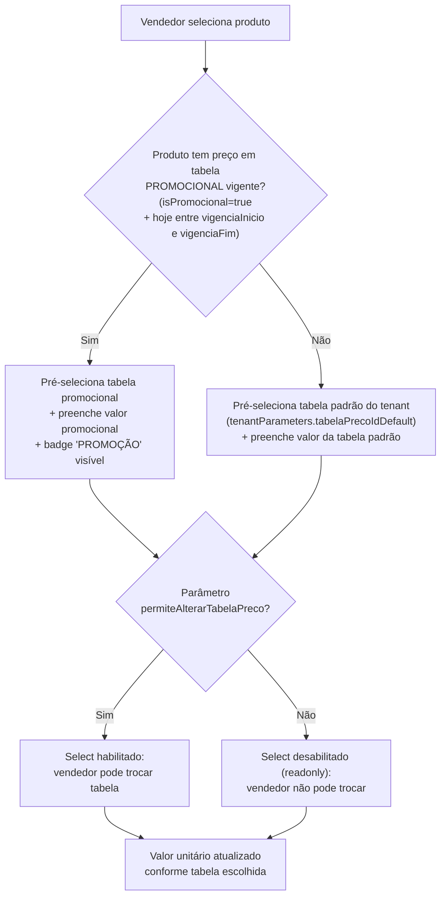

# Tabelas de Preço Dinâmicas — Suporte Multi-Tabela + Promocional (v2)

> [!NOTE]
> Plano revisado com base nas respostas do usuário. **Nenhum código foi alterado.**

---

## Contexto do Problema

Atualmente o sistema está **hardcoded** para usar apenas a tabela de preço com `TabelaPrecoIdERP == 1` em [RedisProductCatalogRepository.cs:42](file:///c:/Pasta%20de%20Trabalho/Projetos/Analises/Versatus.Net/versatus-force-sales-mvp/src/backend/Versatus.ForcaVendas.Infrastructure/Data/Repositories/RedisProductCatalogRepository.cs#L42).

### Requisitos confirmados:
1. **Tabela Promocional**: O ERP possui os campos `PROMOCAO` (booleano), `VIGENCIAINICIO` e `VIGENCIAFIM` na tabela `VENTABELAPRECO`. Se o produto estiver em tabela promocional vigente, o preço promocional deve vir pré-selecionado.
2. **Tabela Padrão do Tenant** (não do cliente): A tabela de preço padrão é configurada **por tenant/empresa**, não por cliente.
3. **Parâmetro de permissão**: O vendedor **pode** alterar a tabela de preço, mas **somente se um parâmetro do tenant permitir** (`PermiteAlterarTabelaPreco`).

---

## Proposed Changes

### Componente 1 — Parâmetros do Tenant (Nova Funcionalidade)

Atualmente os parâmetros do tenant no ErpAdapter são apenas `FilialId` e `FullSyncHour` lidos via `IConfiguration` ([CatalogExporter.cs:65](file:///c:/Pasta%20de%20Trabalho/Projetos/Analises/Versatus.Net/versatus-force-sales-mvp/src/erp-adapter/Versatus.ForcaVendas.ErpAdapter/Jobs/CatalogExporter.cs#L65)). Precisamos expandir isso para incluir parâmetros comerciais e sincronizá-los com a API/Frontend.

#### [MODIFY] ErpAdapter `appsettings.json`
Adicionar novos parâmetros por tenant:
```diff
 "ErpAdapter": {
   "Tenants": {
     "00000000-0000-0000-0000-000000000001": {
       "FilialId": 1,
-      "FullSyncHour": 11
+      "FullSyncHour": 11,
+      "TabelaPrecoIdDefault": 1,
+      "PermiteAlterarTabelaPreco": true
     }
   }
 }
```

| Parâmetro | Tipo | Default | Descrição |
|---|---|---|---|
| `TabelaPrecoIdDefault` | `int` | `1` | ID da tabela de preço padrão do tenant |
| `PermiteAlterarTabelaPreco` | `bool` | `true` | Se `false`, o vendedor não pode trocar a tabela de preço no modal de item |

#### [NEW] `TenantParametersDto` (em `CatalogSnapshot.cs`)
Novo DTO para transportar os parâmetros do tenant junto com o catálogo:
```csharp
public sealed class TenantParametersDto
{
    public int TabelaPrecoIdDefault { get; set; } = 1;
    public bool PermiteAlterarTabelaPreco { get; set; } = true;
}
```

#### [MODIFY] `CatalogSnapshot.cs` — Adicionar campo de parâmetros:
```diff
 public sealed class CatalogSnapshot
 {
     public bool IsFullSync { get; set; } = true;
     public IReadOnlyList<ClienteCatalogDto> Clientes { get; set; } = ...;
     public IReadOnlyList<ProdutoCatalogDto> Produtos { get; set; } = ...;
     public IReadOnlyList<TabelaPrecoCatalogDto> TabelasPreco { get; set; } = ...;
+    public IReadOnlyList<TabelaPrecoMetadataDto> TabelasPrecoMetadata { get; set; } = ...;
     public IReadOnlyList<CondicaoPagamentoCatalogDto> CondicoesPagamento { get; set; } = ...;
+    public TenantParametersDto TenantParameters { get; set; } = new();
 }
```

---

### Componente 2 — Modelo de Dados (DTOs)

#### [MODIFY] [CatalogSnapshot.cs](file:///c:/Pasta%20de%20Trabalho/Projetos/Analises/Versatus.Net/versatus-force-sales-mvp/src/backend/Versatus.ForcaVendas.Infrastructure/Integration/Models/CatalogSnapshot.cs)

**2a. Adicionar campos promocionais ao `TabelaPrecoCatalogDto`:**
```diff
 public sealed class TabelaPrecoCatalogDto
 {
     public int TabelaPrecoEstoqueIdERP { get; set; }
     public int ProdutoIdERP { get; set; }
     public int TabelaPrecoIdERP { get; set; }
     public decimal ValorUnitario { get; set; }
     public decimal PercentualDescontoMaximo { get; set; }
     public bool ControlaDescontoMaximo { get; set; }
     public string Descricao { get; set; } = string.Empty;
+    public bool IsPromocional { get; set; }
+    public DateTime? VigenciaInicio { get; set; }
+    public DateTime? VigenciaFim { get; set; }
 }
```

**2b. Novo DTO para metadados da tabela-mãe (`VENTABELAPRECO`):**
```csharp
public sealed class TabelaPrecoMetadataDto
{
    public int TabelaPrecoIdERP { get; set; }
    public string Descricao { get; set; } = string.Empty;
    public bool IsPromocional { get; set; }
    public bool Ativa { get; set; } = true;
    public DateTime? VigenciaInicio { get; set; }
    public DateTime? VigenciaFim { get; set; }
}
```

---

### Componente 3 — ERP Adapter (Exportação)

#### [MODIFY] [CatalogExporter.cs](file:///c:/Pasta%20de%20Trabalho/Projetos/Analises/Versatus.Net/versatus-force-sales-mvp/src/erp-adapter/Versatus.ForcaVendas.ErpAdapter/Jobs/CatalogExporter.cs)

**3a. Incluir campos `PROMOCAO`, `VIGENCIAINICIO`, `VIGENCIAFIM`** na query de tabelas de preço (JOIN com `VENTABELAPRECO`):
```diff
 SELECT 
     t.IDVENTABELAPRECOESTOQUE,
     t.IDESTESTOQUE,
     t.IDVENTABELAPRECO,
     t.PRECO,
     COALESCE(t.PERCENTUALDESCONTOMAXIMO, 0),
     COALESCE(t.DESCONTOMAXIMODIFERENTE, 0),
-    COALESCE(tp.DESCRICAO, '') AS DESCRICAO
+    COALESCE(tp.DESCRICAO, '') AS DESCRICAO,
+    COALESCE(tp.PROMOCAO, 0) AS PROMOCAO,
+    tp.VIGENCIAINICIO,
+    tp.VIGENCIAFIM
 FROM VENTABELAPRECOESTOQUE t
 LEFT JOIN VENTABELAPRECO tp ON t.IDVENTABELAPRECO = tp.IDVENTABELAPRECO
 WHERE t.ATIVO = 1 AND t.IDGLOFILIAL = @FilialId
```

**3b. Nova query SQL** para buscar metadados da tabela-mãe `VENTABELAPRECO`:
```sql
SELECT 
    IDVENTABELAPRECO,
    DESCRICAO,
    COALESCE(PROMOCAO, 0) AS PROMOCAO,
    VIGENCIAINICIO,
    VIGENCIAFIM
FROM VENTABELAPRECO
WHERE ATIVO = 1
```

**3c. Ler os parâmetros do tenant** (`TabelaPrecoIdDefault`, `PermiteAlterarTabelaPreco`) do `IConfiguration` e incluir no snapshot:
```csharp
var tabelaPadrao = _config.GetValue<int>($"ErpAdapter:Tenants:{tenantId}:TabelaPrecoIdDefault", 1);
var permiteAlterar = _config.GetValue<bool>($"ErpAdapter:Tenants:{tenantId}:PermiteAlterarTabelaPreco", true);

snapshot.TenantParameters = new TenantParametersDto
{
    TabelaPrecoIdDefault = tabelaPadrao,
    PermiteAlterarTabelaPreco = permiteAlterar
};
```

**3d. Exportar novos arquivos via FTP:**
- `tabelas-preco-metadata.json` (metadados das tabelas)
- `tenant-parameters.json` (parâmetros do tenant)

**3e. Remover `GenerateSimulatedCatalog` e `UseSimulatedCatalog`** — Limpeza de dados fictícios do código de produção:

1. **Deletar** o método `GenerateSimulatedCatalog` (L472-501)
2. **Remover** o bloco `if (useSimulated)` (L116-128) que gera catálogo fictício
3. **Alterar o `catch`** (L141-153) para **não sobrescrever** o Redis com dados fictícios — apenas logar o erro e retornar:
```diff
 catch (Exception ex)
 {
-    _logger.LogWarning("Falha ao consultar SQL Server do ERP ({Msg}). Usando catálogo simulado para tenant {TenantId}.", ex.Message, tenantId);
-    snapshot = GenerateSimulatedCatalog(tenantId);
-    ...
+    _logger.LogError(ex, "Falha ao consultar SQL Server do ERP para tenant {TenantId}. Catálogo NÃO atualizado.", tenantId);
+    return;
 }
```
4. **Remover** o parâmetro `useSimulated` do método `ExportCatalogForTenantAsync`
5. **Remover** a configuração `UseSimulatedCatalog` do `appsettings.json` e `appsettings.Production.json`
6. **Remover** a leitura de `UseSimulatedCatalog` do `IConfiguration` no loop principal

---

### Componente 4 — Worker (Sync)

#### [MODIFY] [CatalogSyncJob.cs](file:///c:/Pasta%20de%20Trabalho/Projetos/Analises/Versatus.Net/versatus-force-sales-mvp/src/worker/Versatus.ForcaVendas.Worker/Jobs/CatalogSyncJob.cs)

Adicionar sincronização dos dois novos segmentos para o Redis:
- `catalogo:{tenantId}:tabelas-preco-metadata` ← metadados das tabelas
- `catalogo:{tenantId}:tenant-parameters` ← parâmetros do tenant

#### [MODIFY] [FtpIntegrationTransport.cs](file:///c:/Pasta%20de%20Trabalho/Projetos/Analises/Versatus.Net/versatus-force-sales-mvp/src/backend/Versatus.ForcaVendas.Infrastructure/Integration/Ftp/FtpIntegrationTransport.cs)

Incluir download e parse dos novos arquivos `tabelas-preco-metadata.json` e `tenant-parameters.json`.

---

### Componente 5 — API Backend (Repositório + Endpoints)

#### [MODIFY] [ProductSummary.cs](file:///c:/Pasta%20de%20Trabalho/Projetos/Analises/Versatus.Net/versatus-force-sales-mvp/src/backend/Versatus.ForcaVendas.Application/Catalogo/ProductSummary.cs)

Adicionar preços por tabela ao retorno:
```diff
 public sealed record ProductSummary(
     string ProductId,
     string Sku,
     string Name,
     string Unit,
     decimal Price,
-    decimal AvailableStock);
+    decimal AvailableStock,
+    IReadOnlyList<PriceTableEntry>? PricesByTable = null);

+public sealed record PriceTableEntry(
+    int TabelaPrecoIdERP,
+    int TabelaPrecoEstoqueIdERP,
+    string Descricao,
+    decimal ValorUnitario,
+    bool IsPromocional,
+    DateTime? VigenciaInicio,
+    DateTime? VigenciaFim);
```

#### [MODIFY] [RedisProductCatalogRepository.cs](file:///c:/Pasta%20de%20Trabalho/Projetos/Analises/Versatus.Net/versatus-force-sales-mvp/src/backend/Versatus.ForcaVendas.Infrastructure/Data/Repositories/RedisProductCatalogRepository.cs)

Remover o hardcode de `TabelaPrecoIdERP == 1`:
```diff
-// Tabela de preço padrão = 1
-var priceDict = redisPrices?
-    .Where(p => p.TabelaPrecoIdERP == 1)
-    .ToDictionary(p => p.ProdutoIdERP, p => p.ValorUnitario) ?? [];
+// Ler parâmetros do tenant para obter tabela padrão
+var tenantParamsJson = await db.StringGetAsync($"catalogo:{request.TenantId}:tenant-parameters");
+var tenantParams = tenantParamsJson.HasValue
+    ? JsonSerializer.Deserialize<TenantParametersDto>(tenantParamsJson!, jsonOpts)
+    : new TenantParametersDto();
+var defaultTableId = tenantParams?.TabelaPrecoIdDefault ?? 1;
+
+// Preço principal = tabela padrão do tenant
+var priceDict = redisPrices?
+    .Where(p => p.TabelaPrecoIdERP == defaultTableId)
+    .ToDictionary(p => p.ProdutoIdERP, p => p.ValorUnitario) ?? [];
+
+// Todos os preços agrupados por produto (para enviar ao frontend)
+var pricesByProduct = redisPrices?
+    .GroupBy(p => p.ProdutoIdERP)
+    .ToDictionary(g => g.Key, g => g.Select(p => new PriceTableEntry(...)).ToList());
```

#### [MODIFY] [CatalogoEndpoints.cs](file:///c:/Pasta%20de%20Trabalho/Projetos/Analises/Versatus.Net/versatus-force-sales-mvp/src/backend/Versatus.ForcaVendas.Api/CatalogoEndpoints.cs)

Adicionar dois novos endpoints:
```csharp
// Retorna metadados das tabelas de preço disponíveis (nome, tipo, vigência)
app.MapGet("/catalogo/tabelas-preco-metadata", ...)

// Retorna os parâmetros do tenant (tabela padrão, permissões)
app.MapGet("/catalogo/tenant-parameters", ...)
```

---

### Componente 6 — Frontend (Tipos + API)

#### [MODIFY] [vendas.ts](file:///c:/Pasta%20de%20Trabalho/Projetos/Analises/Versatus.Net/versatus-force-sales-mvp/src/frontend/app/src/types/vendas.ts)

```diff
 export interface Produto {
   id: string;
   sku: string;
   nome: string;
   precoBase: number;
+  precosPorTabela: PriceTableEntry[];
   imagemUrl?: string;
 }

+export interface PriceTableEntry {
+  tabelaPrecoIdERP: number;
+  tabelaPrecoEstoqueIdERP: number;
+  descricao: string;
+  valorUnitario: number;
+  isPromocional: boolean;
+  vigenciaInicio?: string;
+  vigenciaFim?: string;
+}

+export interface TabelaPrecoMetadata {
+  tabelaPrecoIdERP: number;
+  descricao: string;
+  isPromocional: boolean;
+  ativa: boolean;
+  vigenciaInicio?: string;
+  vigenciaFim?: string;
+}

+export interface TenantParameters {
+  tabelaPrecoIdDefault: number;
+  permiteAlterarTabelaPreco: boolean;
+}
```

#### [MODIFY] [vendaApi.ts](file:///c:/Pasta%20de%20Trabalho/Projetos/Analises/Versatus.Net/versatus-force-sales-mvp/src/frontend/app/src/lib/vendaApi.ts)

- Atualizar `searchProdutos` para mapear `pricesByTable` → `precosPorTabela`
- Adicionar `getTabelasPrecoMetadata()` → `/catalogo/tabelas-preco-metadata`
- Adicionar `getTenantParameters()` → `/catalogo/tenant-parameters`

---

### Componente 7 — Frontend (UI — ItemModal + Nova Venda)

#### [MODIFY] [page.tsx (Nova Venda)](file:///c:/Pasta%20de%20Trabalho/Projetos/Analises/Versatus.Net/versatus-force-sales-mvp/src/frontend/app/src/app/(admin)/vendas/nova/page.tsx)

- Carregar `tenantParameters` no `useEffect` inicial (junto com condições de pagamento)
- Passar `tenantParameters` para o `ItemModal`

#### [MODIFY] [ItemModal.tsx](file:///c:/Pasta%20de%20Trabalho/Projetos/Analises/Versatus.Net/versatus-force-sales-mvp/src/frontend/app/src/components/vendas/ItemModal.tsx)

**7a. Novos props:**
```typescript
interface ItemModalProps {
  isOpen: boolean
  onClose: () => void
  onAdd: (item: ItemPedido) => void
  tenantParameters: TenantParameters  // ← NOVO
}
```

**7b. Novo `<Select>` de tabela de preço** — visível e habilitado somente quando `tenantParameters.permiteAlterarTabelaPreco === true`. Caso contrário, apenas mostra a tabela selecionada como texto informativo (readonly).

**7c. Lógica de auto-seleção ao escolher um produto:**



**7d. Ao trocar tabela no Select:**
- Atualizar `valorUnitario` com o preço da tabela selecionada
- Atualizar o `tabelaPrecoEstoqueIdERP` que será enviado no pedido

---

### Componente 8 — Offline (IndexedDB)

#### [MODIFY] [offlineDb.ts](file:///c:/Pasta%20de%20Trabalho/Projetos/Analises/Versatus.Net/versatus-force-sales-mvp/src/frontend/app/src/lib/offlineDb.ts)

- Incrementar versão do banco para `3`
- Adicionar store `tabelasPrecoMetadata`
- Adicionar store `tenantParameters`

---

## Resumo de Arquivos Impactados

| # | Arquivo | Ação | Camada |
|---|---|---|---|
| 1 | `CatalogSnapshot.cs` | MODIFY — Novos DTOs + campos | Backend Model |
| 2 | `CatalogExporter.cs` | MODIFY — SQL + export novos JSONs + remover `GenerateSimulatedCatalog` | ERP Adapter |
| 3 | `appsettings.json` (erp-adapter) | MODIFY — Novos parâmetros + remover `UseSimulatedCatalog` | ERP Config |
| 4 | `appsettings.Production.json` (erp-adapter) | MODIFY — Remover `UseSimulatedCatalog` | ERP Config |
| 5 | `FtpIntegrationTransport.cs` | MODIFY — Download novos arquivos | Backend Infra |
| 6 | `CatalogSyncJob.cs` | MODIFY — Sync novos segmentos Redis | Worker |
| 7 | `ProductSummary.cs` | MODIFY — Novo record `PriceTableEntry` | Backend App |
| 8 | `RedisProductCatalogRepository.cs` | MODIFY — Resolver preço via tenant param | Backend Infra |
| 9 | `CatalogoEndpoints.cs` | MODIFY — 2 novos endpoints | Backend API |
| 10 | `vendas.ts` | MODIFY — Novos types | Frontend Types |
| 11 | `vendaApi.ts` | MODIFY — Novas funções API | Frontend Lib |
| 12 | `ItemModal.tsx` | MODIFY — Select de tabela + auto-seleção | Frontend UI |
| 13 | `page.tsx` (nova venda) | MODIFY — Carregar tenant params | Frontend UI |
| 14 | `offlineDb.ts` | MODIFY — Novos stores | Frontend Offline |

---

## Verification Plan

### Automated Tests
```bash
# Backend - build + testes
cd src/backend
dotnet build
dotnet test --filter "Catalog"

# Frontend - build
cd src/frontend/app
npm run build
```

### Manual Verification
1. **Cenário Básico**: Sincronizar catálogo via ERP real (ou mock de testes) → abrir modal de item → verificar que o produto com promoção ativa mostra o preço promocional pré-selecionado
2. **Cenário Troca de Tabela**: Com `PermiteAlterarTabelaPreco = true` → vendedor troca tabela → preço atualiza. Com `false` → Select desabilitado
3. **Cenário Vigência Expirada**: Tabela promocional com `VigenciaFim` no passado → **não** deve ser pré-selecionada, usar tabela padrão do tenant
4. **Cenário Offline**: Tabelas de preço e parâmetros disponíveis no IndexedDB
5. **Cenário Pedido**: Criar pedido com tabela promocional → verificar que `TabelaPrecoEstoqueIdERP` correto é enviado no payload de exportação
